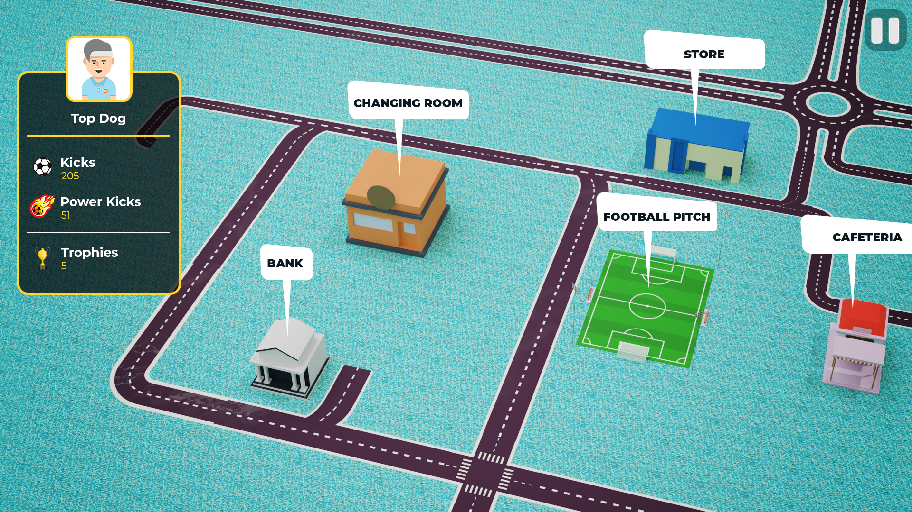

# Game Menu

<!-- \ -->

**Football pitch: **
- This area is where the actual gameplay happens.

- Also used for training up players

**Academy : **
- Where young NFT players can be "trained"

**Store : **
- An NFT Marketplace where the gamer can recruit a player, buy boots or kits 

**Bank : **
- Where KICKS tokens can be staked for xKICKS rewards

**Changing room: **
- Where to see wins, achievements, trophies, all in the form of NFTs 

**Cafeteria :  **
- Where the gamer can pay to replenish NFT footballers stamina 

**Clinic :  **
- Where the gamer can pay to heal injured NFT Footballers 

**Managers Office: **
- Where to see statistics, data analysis

